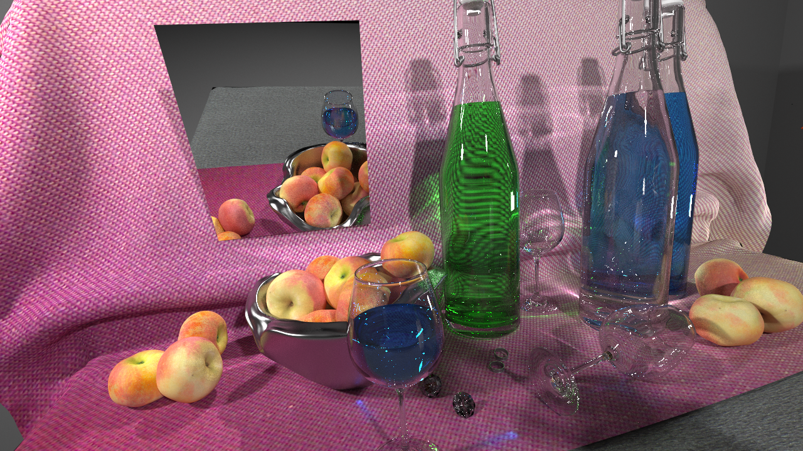

# Imbatracer

Imbatracer is an interactive global illumination renderer. It uses a set of efficient ray traversal kernels written in AnyDSL.

## Status

On the scene side, the following features are supported :

* Triangle meshes (Wavefront OBJ files)
* Textures (TGA and PNG formats)
* Lights (point lights, directional lights, spot lights, environment lights, and triangular area lights)
* Flexible material system. Currently implemented materials are: Lambertian, Phong, Cook-Torrance, glass, and perfect mirror.
* Instancing with rigid body transformations

On the rendering side, the following algorithms work :

* Path Tracing
* Bi-directional Path Tracing
* Vertex Connection and Merging
* Progressive Photon Mapping
* Light Tracing

## Building

This project depends on the [AnyDSL framework](https://github.com/AnyDSL/anydsl) and the [traversal code](https://github.com/AnyDSL/traversal). Additionally, it requires _TBB_, _libpng_, and _SDL2_.
Once the dependencies are installed, use CMake to configure the project and set the `BACKEND` variable to the same value as the one used for the traversal:

    git clone https://user@github.com/AnyDSL/imbatracer
    cd imbatracer
    mkdir build
    cd build
    cmake-gui .. -DBACKEND=<traversal backend>

## Running

The renderer can be tested with the _Still Life_ benchmarking scene:

    cd build
    src/imbatracer/imbatracer ../test/scenes/stilllife/still_life.scene
